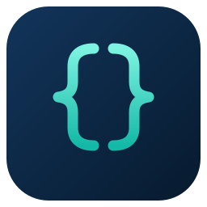

<p align="center">
  
</p>

# coc-json

Json language server extension for [coc.nvim](https://github.com/neoclide/coc.nvim).

[](https://github.com/neoclide/coc-json/actions/workflows/ci.yaml)

The server code is extracted from VSCode, which uses
[vscode-json-languageservice](https://www.npmjs.com/package/vscode-json-languageservice)

For highlight of jsonc filetype, you may need [jsonc.vim](https://github.com/neoclide/jsonc.vim)

## Install

In your vim/neovim, run the following command:

```
:CocInstall coc-json
```

## Features

Same as VSCode.

All features of [vscode-json-languageservice](https://www.npmjs.com/package/vscode-json-languageservice) are supported.

- `doCompletion` for JSON properties and values based on the document's JSON schema.
- `doHover` for values based on descriptions in the document's JSON schema.<Paste>
- Document Symbols for quick navigation to properties in the document.
- Document Colors for showing color decorators on values representing colors.
- Code Formatting supporting ranges and formatting the whole document.
- Diagnostics (Validation) are pushed for all open documents
  - syntax errors
  - structural validation based on the document's JSON schema.

## Commands

- `json.clearCache`: Clear schema cache.
- `json.retryResolveSchema`: Retry resolve schema of current buffer.
- `json.sort`: Sort json document.
- `json.selectSchema`: Select a schema for the current file (`CocList jsonschemas`). The chosen association is remembered and applied through `json.schemas`.
- `json.showSchemaList`: Show the schemas associated with the current file and open the selected one.
- `json.copy`: Copy the JSON path of the cursor position, e.g. `glossary.GlossDiv.GlossList.GlossEntry.GlossTerm`.
- `json.validate`: Validate JSON content against a schema, `json.validate <schemaUrl> <content>`.
- `json.configureTrustedDomains`: Configure trusted schema download domains for the current file.

`json.copy` also registers the keymap `<Plug>(coc-json-copy)` through the
`workspace.registerKeymap` API, bind it in your vimrc like:

```vim
nmap jc <Plug>(coc-json-copy)
```

## Configuration options

- `json.enable`: Enable json server default: `true`
- `json.enableDefaultSchemas`: Enable builtin schemas from https://raw.githubusercontent.com/SchemaStore/schemastore/master/src/api/json/catalog.json default: `true`
- `json.trace.server`: default: `"off"`
  Valid options: ["off","messages","verbose"]
- `json.execArgv`: default: `[]`
- `json.validate.enable`: Enable/disable JSON validation. default: `true`
- `json.format.enable`: Enable format for json server default: `true`
- `json.format.keepLines`: Keep all existing new lines when formatting. default: `false`
- `json.maxItemsComputed`: The maximum number of outline symbols and folding regions computed (limited for performance reasons). default: `5000`
- `json.schemaDownload.enable`: When enabled, JSON schemas can be fetched from http and https locations. default: `true`
- `json.schemaDownload.trustedDomains`: Schema download domains are trusted by default and recorded here automatically. Set a domain to `false` to block it. Use `:CocConfig` to manage (keys can be full domains, full URIs or wildcard patterns like `https://*.example.com` or `*`).
- `json.schemas`: Schemas associations for json files default: `[]`
- `json.validate.comments`: Severity of problems when comments are not permitted in JSON. Valid options: ["error","warning","ignore"]
- `json.validate.trailingCommas`: Severity of trailing comma problems. Valid options: ["error","warning","ignore"]
- `json.validate.schemaValidation`: Severity of problems from schema validation. Valid options: ["error","warning","ignore"]
- `json.validate.schemaRequest`: Severity of problems when a schema cannot be resolved. Valid options: ["error","warning","ignore"]

When a `json.schemas` entry has a `fileMatch` pattern, catalog schemas that
can match the same file name are skipped, so your association takes precedence
over the built-in schemas.

Other extensions can contribute schema registries through
`contributes.jsonValidationRegistry` files (`{ "schemas": [{ "url", "fileMatch" }] }`);
changes are picked up automatically.

## FAQ

### How to suppress error `[json 521] [e] Comments are not permitted in JSON`?

You can configure your vim to make that file with jsonc filetype to allow comment.

### How to add custom schema definitions/properties?

You have two choices:

- use `$schema` in your json.
- create json schema file and then configure `json.schemas` in your `coc-settings.json`, check out https://github.com/neoclide/coc-json/blob/06ea3ace3d0c0a8deaa70942d63345718f029612/package.json#L84

### Quotes are hidden?

This is not caused by coc-json, you may checkout the `conceallevel` option.

## License

MIT
